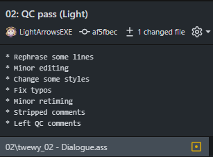

# Setting up Git

!!! Warning
    This guide
    assumes the reader to be a Windows user,
    however most of the information found here
    can still be used Linux/MacOS users,
    as well as users who prefer
    to use git directly
    through the terminal.

When working in a group,
you'll often find
multiple people making changes
to the same or multiple files.
The Translator will need
a place to
upload their translation to,
the typesetter(s) may need
a place where they can
upload their typesetting,
etc.

For this kind of operation,
a git environment is preferable.
With git you can very easily
do version control,
allowing you to see
who made changes to what files
and when,
and also create an easy place
to find all the relevant files
and their contents
without requiring users
to blindly download files
to edit them
the same way they would
when working in an FTP setup.

## Using the Kaleido project template

Most projects are structured the same
or very similarly.
Because of this,
we at Kaleido
have created our own
[project template][template].
This template is updated regularly.

You can use this template
by pressing this button
in the top-right corner of the page:

This will open the following page:

Give your repository a name,
create it under your own username
or an organisation you have writing to,
and decide whether to make the repository public or private.
You can then create the repository
by clicking the "Create repository" button.

[template]: https://github.com/Kaleido-subs/project-template

## Adding users

If you're working with multiple people,
you'll want to make sure to give them access
to the repository.
To do this,
navigate to the repository's settings,
and then click on "Collaborators".

Here you can manage what users
(and teams in an organization) have access to
in your repository.
When inviting project staff,
make sure to give them writing access.

## Basic actions

If you are new to Git and GitHub,
it's recommended to use the [GitHub Desktop client][gh-client].
This guide was written under the assumption
that most readers will be using this client.

### Cloning

After installing the desktop client,
open it and log in.
Now you need to add the repository to your system.
You can do this by going to `File > Clone repository`,
or by opening the repository in your browser
and going to `Code > Open with GitHub Desktop`.

[gh-client]: https://github.com/apps/desktop

### Syncing file changes

When editing files from a git repository,
git will remember and verify
what files have been changed.
Before making any commits however,
you’ll want to first double-check
that you have every file pulled
to your local repository.
Click "Fetch origin" at the top,
and pull in any newly-pushed commits
made by other users.

Now you can verify your own changes
and commit the files
you want to upload/update in the repository.
The desktop client
will additionally give you
a very useful display
of what is different
between your file
and the latest version
of the file
you pulled in
from the repository.

To make things easier for your teammates,
you’ll want to make sure to give your commit
a helpful title,
as well as a description if necessary.
An example of a helpful commit title
would be an episode number
and what you did in the commit.
For example, `03: Typeset train sign`
or `08: Edited Part A`.
The description can contain
more detailed information,
like what exactly was changed
(if multiple things were changed),
what problems you ran across along the way,
etc.

